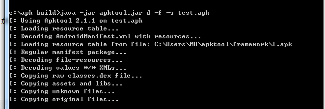
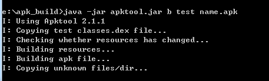
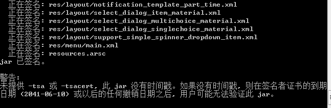
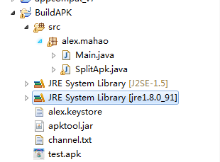
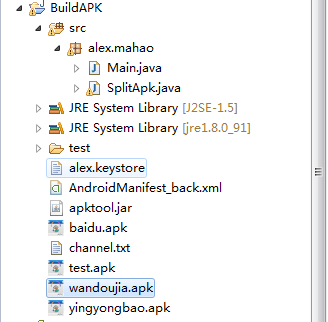

## apktool 编译与反编译apk与Eclipse 多渠道打包

想自己做个apk，还在为素材而苦恼吗？

看到优秀的apk设计，还在为怎么看到别人的实现代码而苦恼吗？

看着`AndroidStudio` 多渠道打包那么爽，而自己坑爹的还在用Eclipse，始终搞不定多渠道打包而苦恼吗？

现在这些统统都不是问题，以前全要10块8块的，现在全部都要2块。。

看一下本篇博客的大纲：

- 使用`apktool` 反编译apk
- 使用`apktool` 重新编译打包apk
- 使用jdk中的`jarsigner`对新打包的apk进行签名。
- 编写程序实现Eclipse 的 Android 多渠道打包。
- 获取渠道值

在开始之前，上传一个目录图，便于下面的进行


### apktool 反编译apk


apktool 是 Android apk 的一个编译和反编译工具，他是一个jar 包。使用它肯定要先去下载该jar包。可以去官网下载，这里提供一个csdn 的下载地址 [apktool v2.1.1](http://download.csdn.net/detail/lisdye2/9552216)

在使用之前需要配置jdk 环境  ，这个应该搞android 的都配置了。。

下面开始反编译：

关键命令

```java 
java -jar apktool.jar d -f -s apkName

```

- 跳转到我们编译的目录，最好将需要编译的文件和`apktool`放在一起。

- 使用命令

```java 
java -jar apktool.jar d -f -s test.apk
```




执行成功之后，当前目录会出现一个和apk同名的文件夹，该文件夹就是反编译后的资源。打开之后可以看到所有资源文件都能打开，查看。


### apktool 编译apk

反编译之后，我们就用反编译后的文件在进行重新编译。有人会说了，你咋这么蛋疼，一会你就明白了。

命令：
```java 
java -jar apktool.jar b 需要编译的文件 编译后的名字

```

开始操作

仍然在当前目录下，执行如下命令
```java 
java -jar apktool.jar b test name.apk
```



这时候会在需要编译文件的目录里多出一个dist目录，里面包含的就是我们编译好的文件。

我的目录如下
```java 
E:\apk_build\test\dist
```

> 不知道为什么，定义的编译后的名字没有作用，和我们原apk同名。


### 对新编译的 apk 重新签名


这里就需要使用 JDK 中的签名工具`jarsigner`.具体目录位置为
```java 
C:\Program Files\Java\jdk1.8.0_91\bin
```

当然如果配置了JDK环境变量，就不需要写全路径了。

命令：

```java 
jarsigner -digestalg SHA1 -sigalg MD5withRSA -verbose -keystore 签名文件 -storepass 仓库密码 -keypass 口令密码 -signedjar 签名后的文件 待签名的文件 口令名
```

开始操作：

最好将签名文件也放到当前目录：

```java 
jarsigner -digestalg SHA1 -sigalg MD5withRSA -verbose -keystore alex.keystore -storepass 123456 -keypass 111111 -signedjar test_signer.apk E:\apk_build\test\dist\test.apk test
```

这一段很长，就不贴全了，贴个最后签名好的结果



### Eclipse 实现多渠道打包

前面铺垫了这么多，终于开始搞大头了。

先说一下步骤：

- 定义txt文件，保存不同的渠道信息。
- 程序读取渠道信息。
- 对apk 反编译 。
- 替换清单文件中关于渠道包的关键字段。
- 重新编译打包。
- 签名。

是不是一气呵成。下面开始搞，将以友盟多渠道打包举例（流程过程中只贴部分代码，最后的工具类会贴到博客最后）：

先看一下初始的文件目录，稍后会将该工程共享到github。




- 定义txt 文件，保存不同的渠道信息,名字不要改，代码中使用的就是这个名字，改了会出问题。

```java 
baidu
yingyongbao
wandoujia
```

注意： 每一个渠道单独一行。

- 程序读取渠道信息

```java 
/**
	 * 获取渠道字段
	 */
	private void getCannelFile() {
		File file = new File("channel.txt");
		// 如果文件不存在，则提示
		if (file.exists() && file.isFile()) {
			BufferedReader br = null;
			FileReader fr = null;
			try {

				// 获取到渠道的输入流
				br = new BufferedReader(new FileReader(file));

				String line = null;

				while ((line = br.readLine()) != null) {
					// 获取到渠道
					channelList.add(line.trim());
				}

				System.out.println(channelList);
			} catch (Exception e) {
				e.printStackTrace();
			} finally {
				try {
					if (fr != null) {
						fr.close();
					}
					if (br != null) {
						br.close();
					}
				} catch (IOException e) {
					e.printStackTrace();
				}
			}
			System.out.println("*********获取渠道成功 ***********");
		} else {
			System.err
					.println("*********error: channel.txt文件不存在，请添加渠道文件***********");
		}
	}

```

获取到的渠道保存到一个集合中存储，后面用。

- 对apk 反编译

使用apk 反编译，需要用到控制台命令，所以在此编译了一个类，用以调用控制台。

```java 

	/**
	 * 执行控制台指令
	 * 
	 * @param cmd
	 */
	public void runCmd(String cmd) {
		Runtime rt = Runtime.getRuntime();
		BufferedReader br = null;
		InputStreamReader isr = null;
		try {
			// 执行
			Process p = rt.exec(cmd);
			// 获取对应流，一遍打印控制台输出的信息
			isr = new InputStreamReader(p.getInputStream());
			br = new BufferedReader(isr);
			String msg = null;
			while ((msg = br.readLine()) != null) {
				System.out.println(msg);
			}

		} catch (Exception e) {
			e.printStackTrace();
		} finally {
			try {
				if (isr != null) {
					isr.close();
				}
				if (br != null) {
					br.close();
				}
			} catch (IOException e) {
				e.printStackTrace();
			}
		}
	}

```

指令很简单，就和我们之前编译的apk 几乎相似

```java 
		// 1， 将该App 反编译
		String cmdUnpack = "cmd.exe /C java -jar apktool.jar d -f -s "
				+ apkName;
		runCmd(cmdUnpack);

```

`apkName`是待编译的apk。


- 替换清单文件，该过程稍微复杂。因为我们需要替换多个清单文件，所以需要保持一份最初的已做替换

```java 
// 2, 移动清单文件，作为备份

		// 获取编译后后的目录名 和目录文件
		String decodeDir = apkName.split(".apk")[0];
		File decodeDirFile = new File(decodeDir);

		// 获取清单文件
		String maniPath = decodeDirFile.getAbsolutePath()
				+ "\\AndroidManifest.xml";

		// 获取备份清单文件目录 工程根目录
		String maniPathSave = basePath + "\\AndroidManifest_back.xml";

		// 备份清单文件
		new File(maniPath).renameTo(new File(maniPathSave));
		System.out.println("*********备份清单文件 ***********");

```

- 备份完清单文件之后，就开始对每一个渠道执行 替换清单文件 -> 重新编译打包 -> 重新签名。

替换清单文件,在此单独写了一个方法

```java 
/**
	 * 修改渠道值
	 * 
	 * @param sourcePath
	 *            备份清单文件地址
	 * @param targetPath
	 *            目标清单文件地址
	 * @param channelStr
	 *            要求该的渠道值
	 */
	public void updateChannel(String sourcePath, String targetPath,
			String channelStr) {

		BufferedReader br = null;
		FileReader fr = null;
		FileWriter fw = null;
		try {
			// 从备份中读取内容
			fr = new FileReader(sourcePath);
			br = new BufferedReader(fr);
			String line = null;
			StringBuffer sb = new StringBuffer();
			while ((line = br.readLine()) != null) {
				// 如果某一行存在qwertyy 则替换该值
				if (line.contains("qwertyy")) {
					line = line.replaceAll("qwertyy", channelStr);
				}
				sb.append(line + "\n");
			}
			// 写到目标清单文件
			fw = new FileWriter(targetPath);
			fw.write(sb.toString());
		} catch (Exception e) {
			e.printStackTrace();
		} finally {
			try {
				if (fr != null) {
					fr.close();
				}
				if (br != null) {
					br.close();
				}
				if (fw != null) {
					fw.close();
				}
			} catch (IOException e) {
				e.printStackTrace();
			}
		}

	}

```

说一下思路： 先从备份的清单文件中将数据按行读取出来，如果某一行定义了我们的标示，则替换标示为我们的指定渠道值，这样我们就获取到了一个即将打包的清单文件字符串。将其写入到需要打包的目录中。

在此定义的标示为`qwertyy`，应该不会有重复值，如果有，可以自己改，但此值要与清单文件中的对应，例如我测试包中的清单文件的标示为：

```java 
 <meta-data android:name="UMENG_CHANNEL" android:value="qwertyy"/>
```

- 开始打包

```java 
// 重新打包
			String cmdPack = String.format(
					"cmd.exe /C java -jar apktool.jar b %s %s", decodeDir,
					apkName);

			runCmd(cmdPack);

```

- 重新签名

```java 
			// 签名文件地址
			String keyStorePath = basePath + "\\" + keystoreName;

			// 未签名的apk 地址
			String unsign_apk_path = decodeDir + "\\dist\\" + apkName;

			// 签名后的apk
			String sign_apk_path = basePath + "\\" + channelList.get(i)
					+ ".apk";

			String signCmd = jarsignerPath
					+ " -digestalg SHA1 -sigalg MD5withRSA -verbose -keystore "
					+ keyStorePath + " -storepass " + storepass + " -keypass "
					+ keypass + " -signedjar " + sign_apk_path + " "
					+ unsign_apk_path + " " + keyName;

			runCmd(signCmd);

```

`signCmd`有一点特殊，应为我无法再代码中获取到`jarsigner`命令，所以走了一个迂回的方式。

`jarsignerPath`的值为：`C:\\Program Files\\Java\\jdk1.8.0_91\\bin\\jarsigner.exe`,其实就是我本地jdk中该程序的地址。


最后看一下整体的类：

```java 


public class SplitApk {
	HashMap<String, String> qudao = new HashMap<String, String>();// 渠道号，渠道名

	ArrayList<String> channelList = new ArrayList<>();

	String basePath;// 当前文件夹路径

	// apk 名
	private String apkName;

	// 秘钥文件名
	private String keystoreName ;

	//仓库密码
	private String storepass ;

	// 口令密码
	private String keypass ;

	// 口令名
	private String keyName ;

	// 签名工具地址（全路径）
	private String jarsignerPath ;

	public SplitApk(String apkName, String keystoreName, String storepass,
			String keyName, String keypass, String jarsignerPath) {
		this.apkName = apkName;
		this.keystoreName = keystoreName;
		this.storepass = storepass;
		this.keypass = keypass;
		this.keyName = keyName;
		this.jarsignerPath = jarsignerPath;

		this.basePath = new File("").getAbsolutePath();
	}

	public void mySplit() {
		getCannelFile();// 获得自定义的渠道号

		modifyChannel(); // 开始打包

	}

	/**
	 * 修改渠道字段
	 */
	public void modifyChannel() {

		// 1， 将该App 反编译
		String cmdUnpack = "cmd.exe /C java -jar apktool.jar d -f -s "
				+ apkName;
		runCmd(cmdUnpack);

		System.out.println("*********反编译Apk 成功 ***********");

		// 2, 移动清单文件，作为备份

		// 获取编译后后的目录名 和目录文件
		String decodeDir = apkName.split(".apk")[0];
		
		// 
		File decodeDirFile = new File(decodeDir);

		// 获取清单文件
		String maniPath = decodeDirFile.getAbsolutePath()
				+ "\\AndroidManifest.xml";

		// 获取备份清单文件目录 工程根目录
		String maniPathSave = basePath + "\\AndroidManifest_back.xml";

		// 备份清单文件
		new File(maniPath).renameTo(new File(maniPathSave));
		System.out.println("*********备份清单文件 ***********");

		for (int i = 0; i < channelList.size(); i++) {
			
			System.out.println("*********开始搞----"+channelList.get(i)+" ***********");
			// 获取备份文件的内容，修改渠道值，并保存到maniPath 中
			updateChannel(maniPathSave, maniPath, channelList.get(i));
			System.out.println("*********修改清单文件，替换清单文件成功 ***********");

			// 重新打包
			String cmdPack = String.format(
					"cmd.exe /C java -jar apktool.jar b %s %s", decodeDir,
					apkName);

			runCmd(cmdPack);

			System.out.println("*********4,打包成功，开始重新签名 ***********");

			// 签名文件地址
			String keyStorePath = basePath + "\\" + keystoreName;

			// 未签名的apk 地址
			String unsign_apk_path = decodeDir + "\\dist\\" + apkName;

			// 签名后的apk
			String sign_apk_path = basePath + "\\" + channelList.get(i)
					+ ".apk";

			String signCmd = jarsignerPath
					+ " -digestalg SHA1 -sigalg MD5withRSA -verbose -keystore "
					+ keyStorePath + " -storepass " + storepass + " -keypass "
					+ keypass + " -signedjar " + sign_apk_path + " "
					+ unsign_apk_path + " " + keyName;

			runCmd(signCmd);

			System.out.println("*********5," + channelList.get(i)
					+ "签名成功***********");
		}
	}

	/**
	 * 修改渠道值
	 * 
	 * @param sourcePath
	 *            备份清单文件地址
	 * @param targetPath
	 *            目标清单文件地址
	 * @param channelStr
	 *            要求该的渠道值
	 */
	public void updateChannel(String sourcePath, String targetPath,
			String channelStr) {

		BufferedReader br = null;
		FileReader fr = null;
		FileWriter fw = null;
		try {
			// 从备份中读取内容
			fr = new FileReader(sourcePath);
			br = new BufferedReader(fr);
			String line = null;
			StringBuffer sb = new StringBuffer();
			while ((line = br.readLine()) != null) {
				// 如果某一行存在qwertyy 则替换该值
				if (line.contains("qwertyy")) {
					line = line.replaceAll("qwertyy", channelStr);
				}
				sb.append(line + "\n");
			}
			// 写到目标清单文件
			fw = new FileWriter(targetPath);
			fw.write(sb.toString());
		} catch (Exception e) {
			e.printStackTrace();
		} finally {
			try {
				if (fr != null) {
					fr.close();
				}
				if (br != null) {
					br.close();
				}
				if (fw != null) {
					fw.close();
				}
			} catch (IOException e) {
				e.printStackTrace();
			}
		}

	}

	/**
	 * 获取渠道字段
	 */
	private void getCannelFile() {
		File file = new File("channel.txt");
		// 如果文件不存在，则提示
		if (file.exists() && file.isFile()) {
			BufferedReader br = null;
			FileReader fr = null;
			try {

				// 获取到渠道的输入流
				br = new BufferedReader(new FileReader(file));

				String line = null;

				while ((line = br.readLine()) != null) {
					// 获取到渠道
					channelList.add(line.trim());
				}

				System.out.println(channelList);
			} catch (Exception e) {
				e.printStackTrace();
			} finally {
				try {
					if (fr != null) {
						fr.close();
					}
					if (br != null) {
						br.close();
					}
				} catch (IOException e) {
					e.printStackTrace();
				}
			}
			System.out.println("*********获取渠道成功 ***********");
		} else {
			System.err
					.println("*********error: channel.txt文件不存在，请添加渠道文件***********");
		}
	}

	/**
	 * 执行控制台指令
	 * 
	 * @param cmd
	 */
	public void runCmd(String cmd) {
		Runtime rt = Runtime.getRuntime();
		BufferedReader br = null;
		InputStreamReader isr = null;
		try {
			// 执行
			Process p = rt.exec(cmd);
			// 获取对应流，一遍打印控制台输出的信息
			isr = new InputStreamReader(p.getInputStream());
			br = new BufferedReader(isr);
			String msg = null;
			while ((msg = br.readLine()) != null) {
				System.out.println(msg);
			}

		} catch (Exception e) {
			e.printStackTrace();
		} finally {
			try {
				if (isr != null) {
					isr.close();
				}
				if (br != null) {
					br.close();
				}
			} catch (IOException e) {
				e.printStackTrace();
			}
		}
	}
}
```


工具类编写好了，就看怎么使用了

```java 

	public static void main(String[] args) {// 这里用cmd传入参数用

		// apk的名字
		String apkName = "test.apk";
		
		//签名文件
		String keystoreName = "alex.keystore";
		
		// 初始密码
		String storepass = "123456";
		
		// 名字
		String keyName = "test";
		
		// 密码
		String keypass = "111111";
		
		
		
		// 签名工具的地址    去jdk 中找 --- 需要修改
		String jarsignerPath = "C:\\Program Files\\Java\\jdk1.8.0_91\\bin\\jarsigner.exe";

		
		
		// 开始打包
		new SplitApk(apkName,keystoreName,storepass,keyName,keypass,jarsignerPath).mySplit();
	
	}

```

这样就可以了，运行该方法之后，刷新工程，就可以看到在工程目录下我们打好的包




### 获取渠道值

可能会存在，如果我们不用友盟的话，肯定我们自己要获取到标签值，以便做操作。在这里仍用友盟举例：

在这里贴出清单文件的`application`的内容

```xml
<application android:allowBackup="true" android:debuggable="true"
		android:icon="@drawable/ic_launcher" android:label="@string/app_name"
		android:name="com.example.textchannel.MyApplication" android:theme="@style/AppTheme">
		<activity android:label="@string/app_name" android:name=".MainActivity">
			<intent-filter>
				<action android:name="android.intent.action.MAIN" />
				<category android:name="android.intent.category.LAUNCHER" />
			</intent-filter>
		</activity>

		<!-- 打包之后将替换value的值-->
		<meta-data android:name="UMENG_CHANNEL" android:value="qwertyy" />
	</application>
```

- 在我们程序自定义的`Application`中获取

```java 
		ApplicationInfo appInfo;
		try {
			appInfo = this.getPackageManager().getApplicationInfo(
					getPackageName(), PackageManager.GET_META_DATA);
		
		msg = appInfo.metaData.getString("UMENG_CHANNEL");
		} catch (NameNotFoundException e) {
			// TODO Auto-generated catch block
			e.printStackTrace();
		}
```


OVER !!!!.


该工程源码已经上传到[github](https://github.com/AlexSmille/apktool_channel),有需要者请移步。


